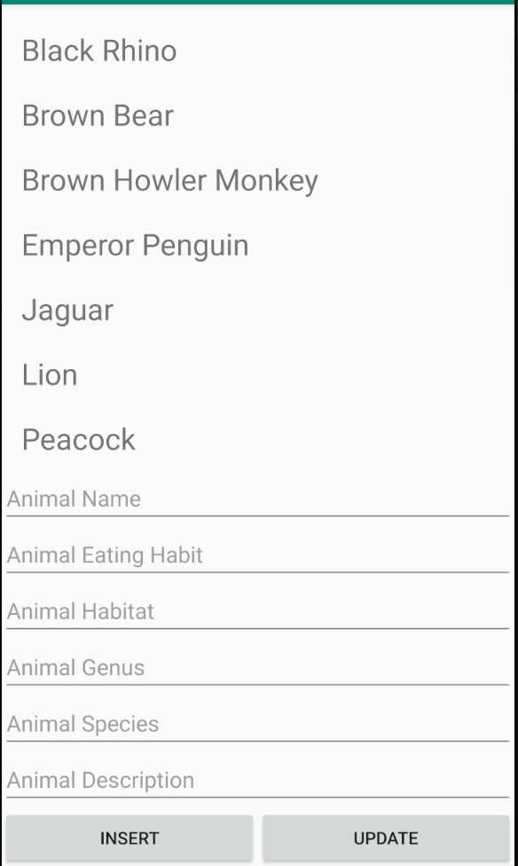
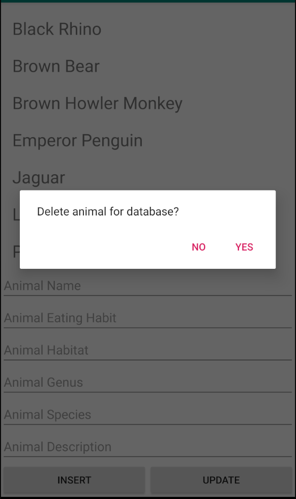
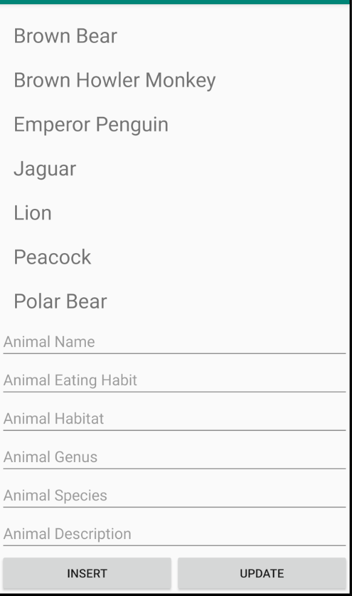
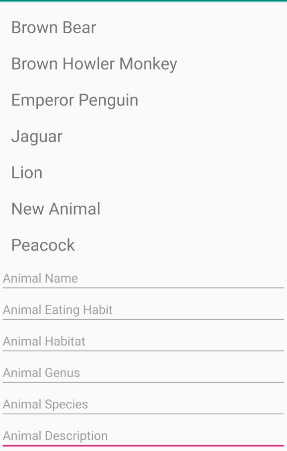
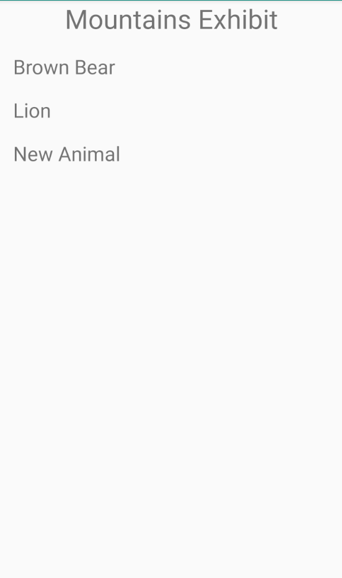
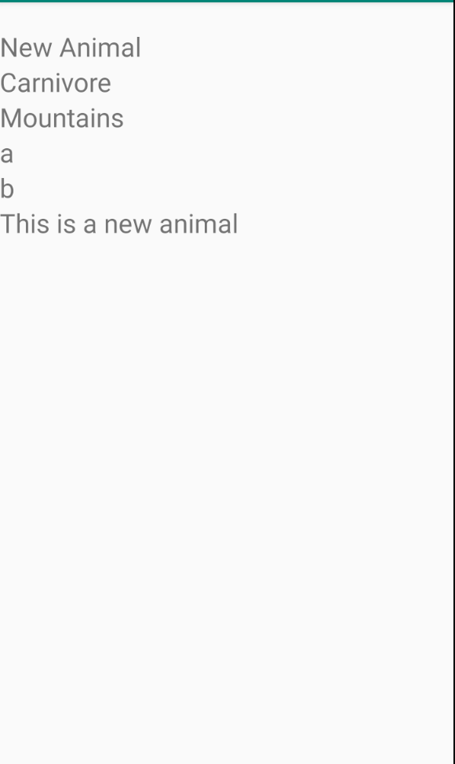

# Week2Daily2Zoo

## MainActivity
The Main Activity features a TextView with a simple message, a Button that takes the user to the CategoryActivity, and another Button to take the user to the Animal Database Edit Activity. There is space for an ImageView to showcase the zoo or more buttons that could lead to additional Activities. The initial set of animals within the database are inserted in this activity.

## AnimalDBEditActivity
The Animal Database Edit Activity holds a RecyclerView with a list of all the animals in the database, six EditText views to take in the details for a new Animal, and two Buttons to insert a new Animal and update an existing Animal. When an Animal is selected in the RecyclerView, a dialog box comes up to ask if the user wants to delete an Animal from the list. If "Yes" is selected, then the Animal is deleted from the list.

 
 

## CategoryActivity
The Category Activity features a ListView showing the zoo's exhibits based off common wildlife habitats. It passes a String holding the name of the category that was selected to AnimalListActivity when a category is tapped.

## AnimalListActivity
The Animal List Activity takes out the passed category string, and then uses the AnimalDatabaseHelper class to query an ArrayList of Animals within that category from the database. Then, the ArrayList is given to the AnimalListAdapter which the RecyclerView uses to display the remaining Animals on screen. When an Animal is selected within the RecyclerView, a copy of the Animal Object is passed to the Animal Details Activity through a Bundle attached to an Intent.

## AnimalDetailsActivity
The Animal Details Activity takes out the Animal Object within the Bundle attached to the calling Intent. Then, it displays all the attribute of the Animal Object on corresponding TextViews and uses a MediaPlayer to play the sound of the Animal.

## Animal class
The Animal class is a simple Java object that implements Parcelable. It contains String variables that hold information regarding a specific animal. It also contains the int id for the resource sound file that is played in AnimalDetailsActivity.

## AnimalListAdapter class
The AnimalListAdapter class handles the ArrayList passed to AnimalListActivity. The listeners for the RecyclerView are also contained within this class.
