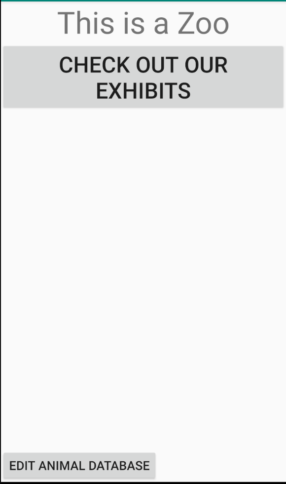

# Week2Daily2Zoo

## MainActivity
The Main Activity features a TextView with a simple message and a Button that takes the user to the CategoryActivity.
There is space for an ImageView to showcase the zoo or more buttons that could lead to additional Activities. An ArrayList of Animal Objects is created in this Activity and passed to the Category Activity through a Bundle attached to an Intent when the Button is pressed.

## CategoryActivity
The Category Activity features a ListView showing the zoo's exhibits based off common wildlife habitats. It does not do anything with the passed ArrayList of Animals, but it passes a String holding the name of the category that was selected along with the passed Bundle with the ArrayList of Animals to AnimalListActivity when a category is tapped.

## AnimalListActivity
The Animal List Activity takes out the passed Bundle and the category String from the calling Intent, and then gets the ArrayList of Animal Objects. It then, iterates through the ArrayList and deletes and Animal Object whose __habitat__ attribute does not match the category that was selected. Afterwards, the ArrayList is given to the AnimalListAdapter which the RecyclerView uses to display the remaining Animals on screen. When an Animal is selected within the RecyclerView, a copy of the Animal Object is passed to the Animal Details Activity through another Bundle attached to an Intent.
 

## AnimalDetailsActivity
The Animal Details Activity takes out the Animal Object within the Bundle attached to the calling Intent. Then, it displays all the attribute of the Animal Object on corresponding TextViews and uses a MediaPlayer to play the sound of the Animal.
 

## Animal class
The Animal class is a simple Java object that implements Parcelable. It contains String variables that hold information regarding a specific animal. It also contains the int id for the resource sound file that is played in AnimalDetailsActivity.

## AnimalListAdapter class
The AnimalListAdapter class handles the ArrayList passed to AnimalListActivity. The listeners for the RecyclerView are also contained within this class.
